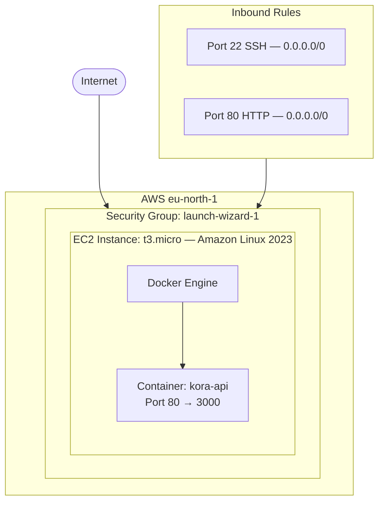

# Deployment Documentation — Kora Analytics API

> Everything a new engineer needs to understand, reproduce, and operate
> the cloud infrastructure behind the Kora Analytics API.

---

## Table of Contents

1. [Cloud Provider & Rationale](#cloud-provider--rationale)
2. [Infrastructure Overview](#infrastructure-overview)
3. [Virtual Machine Setup](#virtual-machine-setup)
4. [Security Configuration](#security-configuration)
5. [Docker Installation](#docker-installation)
6. [Checking Container Status](#checking-container-status)
7. [Viewing Application Logs](#viewing-application-logs)
8. [Bonus: Automatic Rollback](#bonus-automatic-rollback)

---

## Cloud Provider & Rationale

**Provider:** Amazon Web Services (AWS)
**Service:** EC2 (Elastic Compute Cloud)
**Region:** eu-north-1 (Stockholm)

AWS was chosen for the following reasons:

- **Free Tier** — t3.micro instances are eligible for 750 free hours/month
  for the first 12 months, making this deployment completely cost-free
- **Amazon Linux 2023** — AWS's own Linux distribution ships optimised for
  EC2, has excellent Docker support via `dnf`, and receives regular security
  patches
- **Familiarity with the ecosystem** — AWS is the most widely used cloud
  provider and directly relevant to the infrastructure challenges in this
  assessment

---

## Infrastructure Overview



---

## Virtual Machine Setup

### Instance Details

| Property | Value |
|----------|-------|
| Instance type | t3.micro |
| AMI | ami-0a0823e4ea064404d (Amazon Linux 2023) |
| Region | eu-north-1 (Stockholm) |
| Availability Zone | eu-north-1b |
| Public IP | 13.60.228.202 |

### How It Was Provisioned

1. EC2 Console → **Launch Instance**
2. Name: `kora-analytics-server`
3. AMI: Amazon Linux 2023 (free tier eligible)
4. Instance type: t3.micro
5. Created key pair `kora-analytic-server-key` in `.pem` format
6. Configured security group with HTTP (80) and SSH (22) inbound rules
7. Launched the instance

### Connecting via SSH

```bash
# Secure the key file (SSH rejects keys with open permissions)
chmod 400 ~/.ssh/kora-analytic-server-key.pem

# Connect
ssh -i ~/.ssh/kora-analytic-server-key.pem ec2-user@13.60.228.202
```

---

## Security Configuration

| Port | Source | Purpose |
|------|--------|---------|
| 22 (SSH) | 0.0.0.0/0 | Pipeline and manual access |
| 80 (HTTP) | 0.0.0.0/0 | Public API traffic |

Port 22 is currently open to all IPs to allow the GitHub Actions pipeline
to connect from its dynamic runners. In a production environment this would
be restricted to a known IP range or replaced with a more secure access
method that does not require an open SSH port at all.

All secrets (SSH key, server IP, registry credentials) are stored exclusively
as **GitHub repository secrets** and are never written into any file in the
repository.

---

## Docker Installation

After SSHing into the instance:

```bash
# Update system packages
sudo dnf update -y

# Install Docker
sudo dnf install -y docker

# Start Docker and enable it on boot
sudo systemctl enable --now docker

# Allow ec2-user to run Docker without sudo
sudo usermod -aG docker ec2-user
newgrp docker

# Verify
docker --version
```

---

## Checking Container Status

### Is the container running?

```bash
docker ps
```

### Check which image version is deployed

```bash
docker inspect kora-api --format '{{.Image}}'
```

This prints the full image SHA, which maps directly to the Git commit
that triggered the deployment.

### Verify the app is responding

```bash
curl http://localhost/health
# → {"status":"ok"}

curl http://localhost/metrics
# → {"uptime_seconds":...,"memory_mb":...,"node_version":"..."}
```

---

## Viewing Application Logs

```bash
# Most recent logs
docker logs kora-api

# Follow live (stream in real time)
docker logs -f kora-api

# Last 50 lines only
docker logs --tail 50 kora-api

# With timestamps
docker logs -t kora-api
```

---

## Bonus: Automatic Rollback

Before every deployment the pipeline preserves the current image:

```bash
docker tag ghcr.io/.../kora-analytics-api:latest \
           ghcr.io/.../kora-analytics-api:previous
```

After starting the new container it runs a health check:

```bash
curl -f http://localhost/health || exit 1
```

If that check fails, the `Rollback on failure` step (configured with
`if: failure()` in the workflow) immediately restores service:

```bash
docker stop kora-api && docker rm kora-api
docker run -d --name kora-api -p 80:3000 \
  ghcr.io/.../kora-analytics-api:previous
```

The result: if a bad deployment reaches the server, the previous working
version is restored automatically within seconds — no manual SSH required.