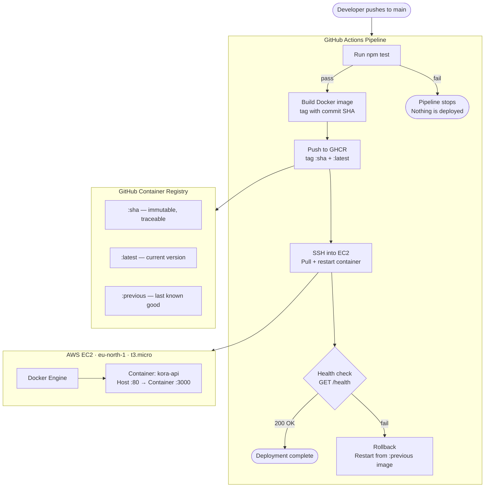
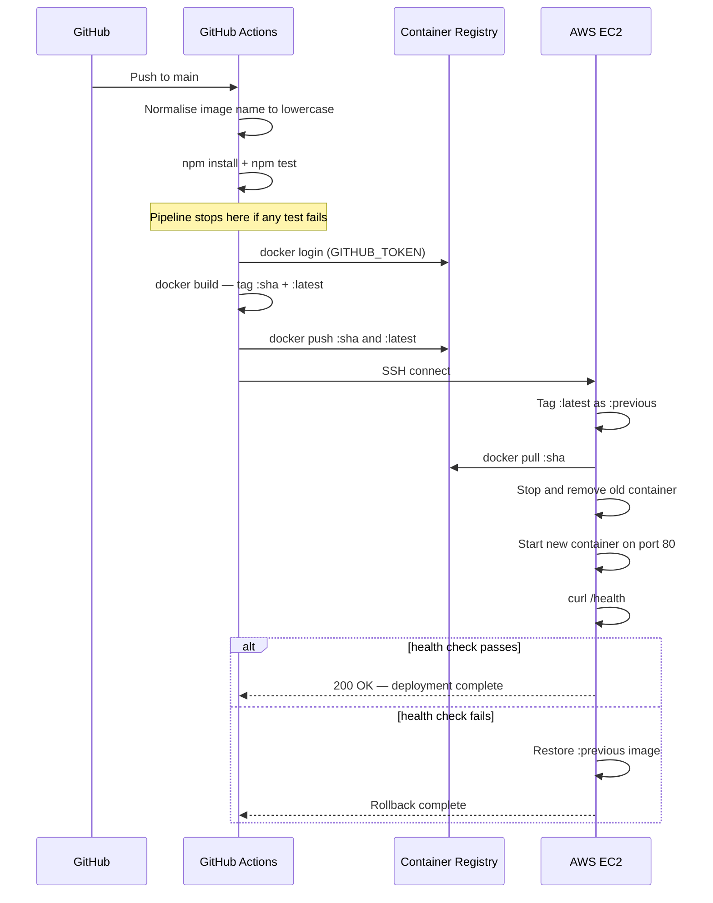

# Kora Analytics API — DevOps Implementation

> **Challenge:** DeployReady &nbsp;·&nbsp; **Track:** DevOps

---

## Overview

Kora Analytics is a SaaS company whose deployment process was entirely manual —
a developer would SSH into the server, pull the latest code, and restart the
process by hand, with no automated testing and no way to catch a broken release
until a customer complained.

This implementation replaces that process with three pillars of modern DevOps:

- **Containerisation** — the app runs inside a reproducible Docker container,
  eliminating environment inconsistencies between development and production
- **Automated testing** — every change is validated by Jest before anything is
  built or deployed; a failing test stops the pipeline immediately
- **Continuous deployment** — a GitHub Actions pipeline builds, pushes, and
  deploys a new image on every push to `main`, with a built-in health check
  and automatic rollback if the deployment fails

---

## Architecture



---

## Repository Structure

```
DeployReady/
├── app/                   # Node.js application (unmodified)
│   ├── index.js           # Express server — 3 endpoints
│   ├── index.test.js      # Jest test suite — 4 tests
│   └── package.json
├── Dockerfile             # Alpine-based, non-root user
├── docker-compose.yml     # Local development stack
├── .env.example           # Environment variable template
├── .gitignore             # Excludes .env and node_modules
├── DEPLOYMENT.md          # Cloud infrastructure documentation
└── README.md              # This file
```

---

## API Reference

| Method | Route | Description | Example Response |
|--------|-------|-------------|-----------------|
| `GET` | `/health` | Liveness check — used by the pipeline health gate | `{"status":"ok"}` |
| `GET` | `/metrics` | Runtime stats — uptime, memory, Node.js version | `{"uptime_seconds":755,"memory_mb":51,"node_version":"v20.20.2"}` |
| `POST` | `/data` | Accepts any non-empty JSON body and echoes it back | `{"received":{...}}` |

`POST /data` with an empty body returns `400 Bad Request`.

---

## Running Locally

**Prerequisites:** Docker and Docker Compose.

```bash
# 1. Navigate to the challenge folder
cd dev-ops/DeployReady

# 2. Create your local environment file
cp .env.example .env

# 3. Build and start the container
docker compose up --build
```

Test the endpoints:

```bash
curl http://localhost:3000/health
# → {"status":"ok"}

curl http://localhost:3000/metrics
# → {"uptime_seconds":4,"memory_mb":51,"node_version":"v20.20.2"}

curl -X POST http://localhost:3000/data \
  -H "Content-Type: application/json" \
  -d '{"shipment_id": "KOR-001", "status": "in_transit"}'
# → {"received":{"shipment_id":"KOR-001","status":"in_transit"}}
```

Run the test suite without Docker:

```bash
cd app && npm install && npm test
```

---

## CI/CD Pipeline

Defined in `.github/workflows/deploy.yml`. Triggers on every push to `main`
that modifies `dev-ops/DeployReady/**` or the workflow file itself.

### Pipeline Steps



### Secrets

All sensitive values are stored as GitHub repository secrets — nothing
sensitive exists in the codebase:

| Secret | Purpose |
|--------|---------|
| `SERVER_HOST` | EC2 public IP |
| `SERVER_USER` | SSH username |
| `SERVER_SSH_KEY` | Private key for SSH authentication |
| `GHCR_TOKEN` | PAT for pulling images on the server |
| `GHCR_USERNAME` | Registry login username (must be lowercase) |

`GITHUB_TOKEN` is provided automatically by GitHub Actions.

---

## Environment Variables

| Variable | Description | Default |
|----------|-------------|---------|
| `PORT` | Port the server listens on inside the container | `3000` |

---

## Design Decisions

**Alpine base image** — `node:20-alpine` is ~70 MB versus ~350 MB for the
full Debian image. Smaller images pull faster on every deploy and present
a smaller attack surface.

**Non-root container user** — the Dockerfile creates a dedicated `appuser`
with no elevated privileges. If an attacker exploited a vulnerability in
the app, they would have no host-level access.

**GHCR over AWS ECR** — GitHub Container Registry is free for public
repositories and authenticates with `GITHUB_TOKEN` natively, requiring no
additional AWS IAM configuration.

**SHA image tagging** — `:latest` is mutable and tells you nothing about
what code is running. The SHA tag is immutable: any running container can
be traced back to the exact commit and test run that produced it.

**Automatic rollback** — the pipeline saves the current image as `:previous`
before every deploy. If the post-deploy health check fails, the previous
version is restored automatically with no manual intervention.

---

## Live Deployment

| Property | Value |
|----------|-------|
| Cloud Provider | AWS |
| Region | eu-north-1 (Stockholm) |
| Instance Type | t3.micro |
| OS | Amazon Linux 2023 |
| Public IP | 13.60.228.202 |

```bash
curl http://13.60.228.202/health
# → {"status":"ok"}
```

See [DEPLOYMENT.md](./DEPLOYMENT.md) for full infrastructure and operational details.