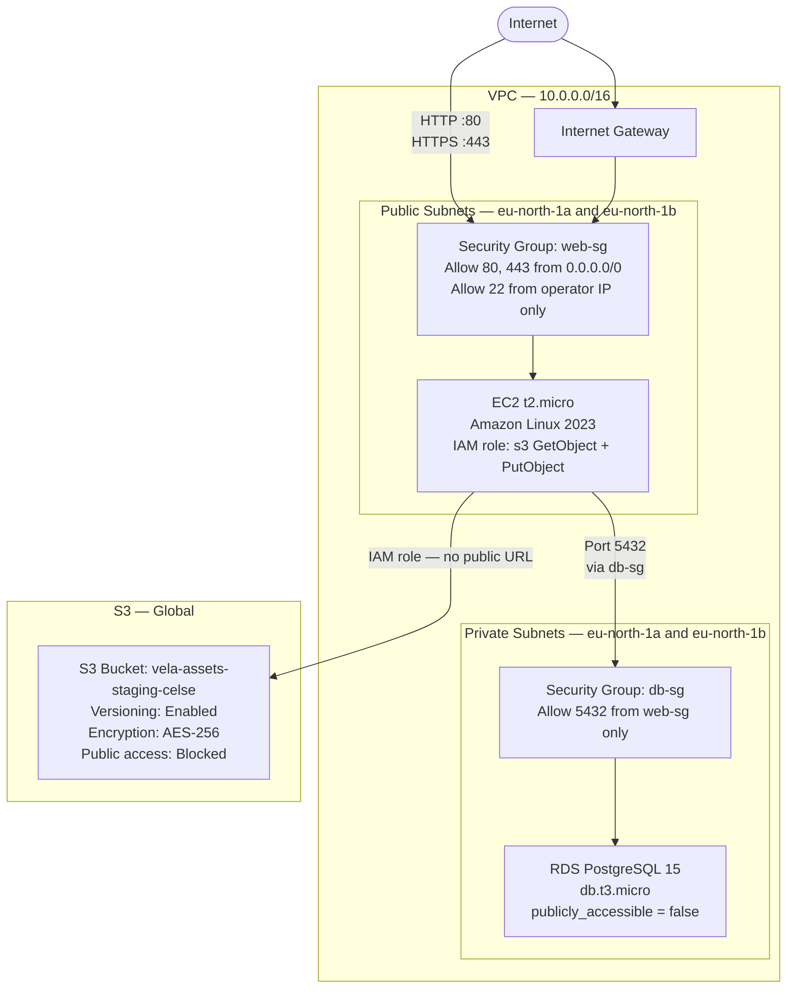

# InfraBlueprint — Vela Payments Infrastructure as Code

> **Challenge:** InfraBlueprint &nbsp;·&nbsp; **Track:** DevOps

---

## Table of Contents

1. [Problem Statement](#problem-statement)
2. [Architecture](#architecture)
3. [Repository Structure](#repository-structure)
4. [Setup Instructions](#setup-instructions)
5. [Variable Reference](#variable-reference)
6. [Outputs](#outputs)
7. [Multi-Environment Support](#multi-environment-support)
8. [Design Decisions](#design-decisions)

---

## Problem Statement

Vela Payments built their entire AWS infrastructure by clicking through the
console over two years. No documentation existed. When their lead engineer
left, no one knew what was running, what it cost, or how to rebuild it.

The goal of this implementation is simple: **if the entire AWS account was
deleted tomorrow, a new engineer should be able to rebuild everything by
running a single command.**

This is achieved using Terraform — every resource is defined in code,
versioned in Git, and reproducible from scratch with `terraform apply`.

---

## Architecture



### Security boundaries at a glance

| Traffic | Allowed | Blocked |
|---------|---------|---------|
| Internet → EC2 (HTTP/HTTPS) | ✅ | |
| Internet → EC2 (SSH) | ✅ Operator IP only | ❌ All other IPs |
| Internet → RDS | | ❌ Always |
| EC2 → RDS (PostgreSQL) | ✅ via security group rule | |
| Internet → S3 (direct URL) | | ❌ Public access blocked |
| EC2 → S3 (via IAM role) | ✅ GetObject + PutObject only | |

---

## Repository Structure

```
InfraBlueprint/
├── infra/
│   ├── main.tf            # All resource definitions (VPC, EC2, RDS, S3, IAM)
│   ├── variables.tf       # Variable declarations with descriptions
│   ├── outputs.tf         # EC2 IP, RDS endpoint, S3 bucket name, VPC ID
│   ├── staging.tfvars     # Staging environment values (placeholder credentials)
│   ├── production.tfvars  # Production environment values (placeholder credentials)
│   └── .gitignore         # Excludes .terraform/, state files, real tfvars
└── example.tfvars         # Template — copy and fill in real values
```

---

## Setup Instructions

### Prerequisites

- [Terraform](https://developer.hashicorp.com/terraform/install) >= 1.5
- [AWS CLI](https://docs.aws.amazon.com/cli/latest/userguide/install-cliv2.html) configured with valid credentials
- An AWS account (free tier is sufficient)

### Step 1 — Configure AWS credentials

```bash
aws configure
# Enter your Access Key ID, Secret Access Key, region (eu-north-1), output (json)

# Verify credentials are working
aws sts get-caller-identity
```

### Step 2 — Create the Terraform state bucket

The S3 backend requires a bucket to exist before `terraform init` can run.
This bucket stores the Terraform state file remotely so it is never lost
and can be shared across team members. Create it once manually:

```bash
# Create the bucket
aws s3api create-bucket \
  --bucket vela-terraform-state-celse \
  --region eu-north-1 \
  --create-bucket-configuration LocationConstraint=eu-north-1

# Enable versioning — allows recovery from accidental state corruption
aws s3api put-bucket-versioning \
  --bucket vela-terraform-state-celse \
  --versioning-configuration Status=Enabled

# Block all public access — state files can contain sensitive values
aws s3api put-public-access-block \
  --bucket vela-terraform-state-celse \
  --public-access-block-configuration \
    "BlockPublicAcls=true,IgnorePublicAcls=true,BlockPublicPolicy=true,RestrictPublicBuckets=true"
```

### Step 3 — Create your tfvars file

```bash
cd infra/

# Copy the example and fill in real values
cp ../example.tfvars my.tfvars
```

Edit `my.tfvars`:

```hcl
aws_region       = "eu-north-1"
vpc_cidr         = "10.0.0.0/16"
allowed_ssh_cidr = "YOUR_IP/32"   # run: curl https://checkip.amazonaws.com
db_username      = "velaadmin"
db_password      = "a-strong-password-here"
s3_bucket_name   = "vela-assets-staging-celse"
ec2_ami          = "ami-0a0823e4ea064404d"
environment      = "staging"
```

> **Never commit a tfvars file containing real credentials.** Real tfvars
> files are listed in `.gitignore`. Only the placeholder files
> (`staging.tfvars`, `production.tfvars`) are committed.

### Step 4 — Initialise and plan

```bash
cd infra/

# Download the AWS provider and connect to the S3 backend
terraform init

# Validate configuration syntax
terraform validate

# Preview all resources that will be created
terraform plan -var-file="staging.tfvars"
```

The plan should show **21 resources to add** and zero errors.

### Step 5 — Apply (optional)

```bash
terraform apply -var-file="staging.tfvars"
```

### Step 6 — Destroy when done

RDS incurs charges after the free tier. Always destroy when finished:

```bash
terraform destroy -var-file="staging.tfvars"
```

---

## Variable Reference

| Variable | Type | Description |
|----------|------|-------------|
| `aws_region` | `string` | AWS region to deploy all resources into |
| `vpc_cidr` | `string` | CIDR block for the VPC — default `10.0.0.0/16` |
| `allowed_ssh_cidr` | `string` | Your IP in CIDR notation for SSH access e.g. `102.0.0.1/32` |
| `db_username` | `string` | Master username for the RDS instance — marked `sensitive` |
| `db_password` | `string` | Master password for the RDS instance — marked `sensitive` |
| `s3_bucket_name` | `string` | Globally unique name for the S3 static assets bucket |
| `ec2_ami` | `string` | AMI ID for the EC2 instance — must match the deployment region |
| `environment` | `string` | Deployment environment — `staging` or `production` |

---

## Outputs

After `terraform apply`, the following values are printed:

| Output | Description |
|--------|-------------|
| `ec2_public_ip` | Public IP of the web server — use for DNS or SSH |
| `rds_endpoint` | PostgreSQL connection endpoint for the application |
| `s3_bucket_name` | Name of the static assets bucket |
| `vpc_id` | VPC ID — useful for adding future resources to the same network |

---

## Multi-Environment Support

The codebase supports multiple environments from a single set of Terraform
files using separate `.tfvars` files — no code duplication, no separate
directories.

| Environment | Command |
|-------------|---------|
| Staging | `terraform plan -var-file="staging.tfvars"` |
| Production | `terraform plan -var-file="production.tfvars"` |

Each environment gets its own S3 bucket name and can point to its own
database credentials. The infrastructure topology is identical between
environments — only the values differ.

To deploy production after validating staging:

```bash
terraform apply -var-file="production.tfvars"
```

---

## Design Decisions

**Why a custom VPC instead of the default AWS VPC?**
The default VPC is shared, pre-configured, and has permissive defaults that
accumulate over time. A custom VPC gives full control over the IP address
space, subnet layout, and routing from the start. It also means the
infrastructure is fully portable — it can be deployed into any AWS account
without conflicts.

**Why are private subnets used for RDS?**
The database should never be reachable from the internet, even accidentally.
Placing RDS in private subnets means there is no route from the internet
gateway to the database — the only path in is through the EC2 instance via
the `db-sg` security group rule on port 5432. This is a defence-in-depth
approach: even if the security group were misconfigured, the routing itself
would block access.

**Why IAM roles instead of access keys for S3 access?**
Hardcoded access keys in application code or environment variables are a
common source of credential leaks. An IAM instance profile attached to the
EC2 instance means the application never handles credentials at all — AWS
rotates them automatically behind the scenes. The policy is also scoped to
the minimum required actions (`s3:GetObject` and `s3:PutObject`) on the
specific bucket ARN only.

**Why store Terraform state in S3?**
Local state files are fragile — they get lost when a laptop breaks, and
two engineers running `terraform apply` at the same time will corrupt each
other's state. An S3 backend with versioning enabled means the state is
durable, recoverable, and shared. In a team setting, a DynamoDB lock table
would be added to prevent concurrent applies.
