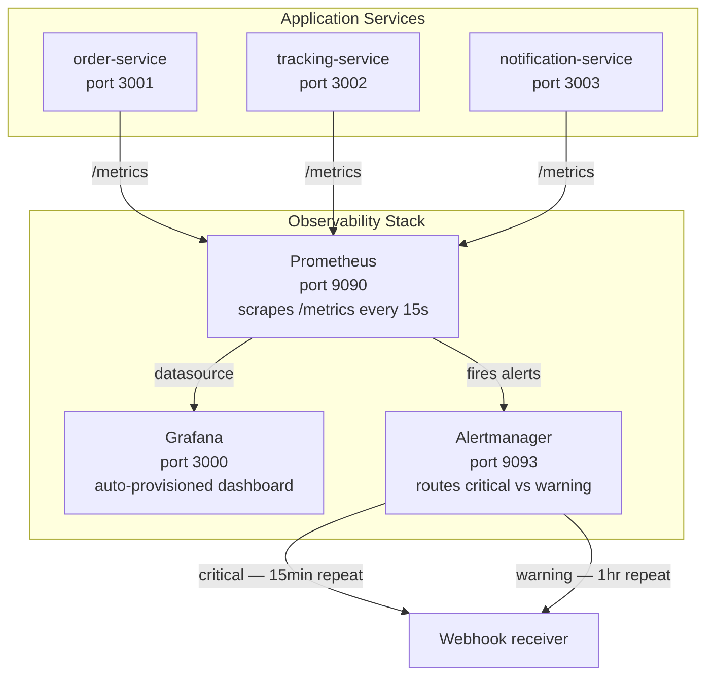
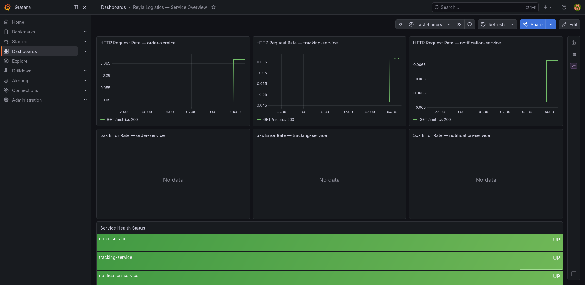

# WatchTower — Reyla Logistics Observability Stack

> **Challenge:** WatchTower &nbsp;·&nbsp; **Track:** DevOps

---

## Table of Contents

1. [Problem Statement](#problem-statement)
2. [Architecture](#architecture)
3. [Repository Structure](#repository-structure)
4. [Setup Instructions](#setup-instructions)
5. [Dashboard Walkthrough](#dashboard-walkthrough)
6. [Alert Rules](#alert-rules)
7. [Alert Testing](#alert-testing)
8. [Structured Logging](#structured-logging)
9. [Bonus: Alertmanager](#bonus-alertmanager)

---

## Problem Statement

Reyla Logistics runs three backend services — order, tracking, and notification.
Each has gone down at least once in the past month. Every time, the team found
out from an angry customer, not from their own systems. There were no dashboards,
no alerts, and logs were scattered across three separate terminal windows.

This implementation wires a full observability stack around those services:

- **Prometheus** scrapes metrics from all three services every 15 seconds
- **Grafana** visualises request rates, error rates, and health status in a
  pre-built dashboard that loads automatically on startup
- **Alert rules** fire when a service goes down, error rates spike, or scraping
  stops — before any customer notices
- **Alertmanager** routes critical alerts separately with a shorter repeat
  interval so the on-call engineer is notified faster
- **Structured JSON logging** makes logs machine-readable and filterable

---

## Architecture



### Data flow

1. Each service exposes a `/metrics` endpoint in Prometheus exposition format
   via the `prom-client` library
2. Prometheus scrapes all three endpoints every 15 seconds and stores the
   time-series data
3. Grafana queries Prometheus and renders the dashboard panels, refreshing
   every 15 seconds
4. Prometheus evaluates the alert rules every 15 seconds and fires alerts
   to Alertmanager when conditions are met
5. Alertmanager deduplicates, groups, and routes alerts to the appropriate
   receiver based on severity

---

## Repository Structure

```
WatchTower/
├── app/
│   ├── order-service/         # Express + prom-client, port 3001
│   ├── tracking-service/      # Express + prom-client, port 3002
│   └── notification-service/  # Express + prom-client, port 3003
├── prometheus/
│   ├── prometheus.yml         # Scrape config and alertmanager connection
│   └── alerts.yml             # Alert rules: ServiceDown, HighErrorRate, ServiceNotScraping
├── grafana/
│   ├── provisioning/
│   │   ├── datasources/
│   │   │   └── prometheus.yml # Auto-connects Grafana to Prometheus on startup
│   │   └── dashboards/
│   │       └── dashboards.yml # Tells Grafana where to find dashboard JSON files
│   └── dashboards/
│       └── reyla-overview.json # Pre-built dashboard — loads automatically
├── alertmanager/
│   └── alertmanager.yml       # Routes critical and warning alerts separately
├── docker-compose.yml         # Full stack definition
├── .env.example               # Environment variable template
└── .gitignore                 # Excludes .env
```

---

## Setup Instructions

### Prerequisites

- Docker and Docker Compose installed
- Ports 3000, 3001, 3002, 3003, 9090, 9093 available on your machine

### Step 1 — Clone and configure

```bash
git clone https://github.com/Smiley2507/AmaliTech-DEG-Project-based-challenges.git
cd AmaliTech-DEG-Project-based-challenges/dev-ops/WatchTower

# Create your environment file
cp .env.example .env
```

The default values in `.env.example` work out of the box — no changes needed
unless a port is already in use on your machine.

### Step 2 — Start the full stack

```bash
docker compose up --build
```

All seven containers start together: three app services, Prometheus, Grafana,
and Alertmanager.

### Step 3 — Verify the stack

| URL | What to check |
|-----|--------------|
| `http://localhost:9090/targets` | All 3 services show **State: UP** |
| `http://localhost:9090/alerts` | Three alert rules are loaded |
| `http://localhost:3000` | Grafana login page (admin / admin) |
| `http://localhost:3000/dashboards` | "Reyla Logistics — Service Overview" loads automatically |
| `http://localhost:9093` | Alertmanager UI |

### Step 4 — Test the services directly

```bash
# Order service
curl http://localhost:3001/health
curl -X POST http://localhost:3001/orders \
  -H "Content-Type: application/json" \
  -d '{"item": "parcel", "quantity": 2}'

# Tracking service
curl http://localhost:3002/track/SHP-001

# Notification service
curl -X POST http://localhost:3003/notify \
  -H "Content-Type: application/json" \
  -d '{"recipient": "driver@reyla.com", "message": "New delivery assigned"}'
```

### Stop the stack

```bash
docker compose down

# To also remove stored metrics and dashboard data
docker compose down -v
```

---

## Dashboard Walkthrough


The **Reyla Logistics — Service Overview** dashboard loads automatically when
Grafana starts. No manual import is required. It refreshes every 15 seconds.




### Row 1 — HTTP Request Rate (per service)

Three time-series panels showing the per-second request rate for each service,
broken down by HTTP method, route, and status code.

**Query:**
```promql
rate(http_requests_total{job="order-service"}[1m])
```

These panels answer: *"How busy is each service right now?"* A sudden spike
indicates a traffic surge. A sudden drop to zero indicates the service has
stopped receiving traffic entirely.

### Row 2 — 5xx Error Rate (per service)

Three time-series panels showing the rate of server-side errors per second
for each service. These panels show **"No data"** when everything is healthy —
which is the expected state in a working system.

**Query:**
```promql
rate(http_requests_total{job="order-service", status=~"5.."}[5m])
```

These panels answer: *"Is the service returning errors?"* Any value above
zero warrants investigation. Values above 5% of total traffic trigger the
`HighErrorRate` alert.

### Row 3 — Service Health Status

A stat panel showing the current UP/DOWN status of all three services with
colour-coded backgrounds — green for UP, red for DOWN. This is the at-a-glance
health summary that appears at the bottom of the dashboard.

**Query:**
```promql
up{job="order-service"}
```

A value of `1` maps to **UP** (green). A value of `0` maps to **DOWN** (red).
This panel directly reflects what Prometheus sees on the `/targets` page.

---

## Alert Rules

Defined in `prometheus/alerts.yml` and loaded into Prometheus automatically.

| Alert | Condition | Duration | Severity |
|-------|-----------|----------|----------|
| `ServiceDown` | `up == 0` | 1 minute | critical |
| `HighErrorRate` | 5xx errors > 5% of total requests | 5 minutes | warning |
| `ServiceNotScraping` | `up == 0` | 2 minutes | warning |

All rules include a human-readable `summary` (one line) and `description`
(full context including the current metric value) as annotations.

---

## Alert Testing

### Testing `ServiceDown` and `ServiceNotScraping`

Stop one service to simulate a crash:

```bash
docker compose stop order-service
```

1. Go to `http://localhost:9090/targets` — order-service immediately shows
   **State: DOWN**
2. Wait 1 minute — `ServiceDown` alert transitions from **Pending** to
   **Firing** at `http://localhost:9090/alerts`
3. Wait 2 minutes total — `ServiceNotScraping` also transitions to **Firing**
4. On the Grafana dashboard, the Service Health Status panel turns **red** for
   order-service

Restore the service:

```bash
docker compose start order-service
```

Both alerts resolve automatically within the next scrape cycle.

### Testing `HighErrorRate`

Generate a stream of 5xx errors by hitting a non-existent route that returns
500. The services return 404 for unknown routes, so we temporarily add load
that includes error responses. The simplest way to test this alert without
modifying the service is to verify the rule syntax is correct in Prometheus:

```bash
# Confirm the alert rule is loaded and syntactically valid
curl -s http://localhost:9090/api/v1/rules | python3 -m json.tool | grep HighErrorRate
```

In a real environment, error traffic can be generated with:

```bash
# Send 100 requests that will produce non-2xx responses
for i in $(seq 1 100); do
  curl -s http://localhost:3001/nonexistent > /dev/null
done
```

---

## Structured Logging

All services log in JSON format to stdout. Docker captures these logs via the
`json-file` driver configured in `docker-compose.yml`.

### View live logs from all services at once

```bash
docker compose logs -f order-service tracking-service notification-service
```

Example output:

```
tracking-service-1      | {"level":"info","service":"tracking-service","msg":"Listening on port 3002"}
notification-service-1  | {"level":"info","service":"notification-service","msg":"Listening on port 3003"}
order-service-1         | {"level":"info","service":"order-service","msg":"Listening on port 3001"}
```

Each log line is a valid JSON object. The `level`, `service`, and `msg` fields
are present on every line, making logs easy to parse and filter programmatically.

### Filter logs to show only errors from a specific service

```bash
docker compose logs notification-service 2>&1 | grep '"level":"error"'
```

Example output when an error occurs:

```json
{"level":"error","service":"notification-service","msg":"Failed to queue notification","recipient":"driver@reyla.com","error":"connection refused"}
```

When there are no errors the command returns no output — which is the expected
healthy state. To also catch warnings alongside errors:

```bash
docker compose logs notification-service 2>&1 | grep -E '"level":"(error|warn)"'
```

### Why JSON logging?

Plain text logs require human pattern-matching to extract meaning. JSON logs
can be piped directly into tools like `jq`, forwarded to log aggregation
systems, and filtered programmatically without writing custom parsers. The
`json-file` driver also handles log rotation automatically via the `max-size`
and `max-file` options set in `docker-compose.yml`.

---

## Bonus: Alertmanager

Alertmanager is included in the stack and connected to Prometheus. It handles
three responsibilities that plain Prometheus alert rules cannot:

**Alert grouping** — multiple alerts firing at the same time for the same
service are grouped into a single notification, preventing alert storms.

**Severity routing** — `critical` alerts (e.g. `ServiceDown`) are sent to
a dedicated receiver with a 15-minute repeat interval. `warning` alerts use
a 1-hour repeat interval. This means a completely down service pages the
on-call engineer every 15 minutes until resolved, while a high error rate
sends a single reminder per hour.

**Inhibition** — if a `critical` alert is already firing for a service, any
`warning` alerts for the same service are suppressed. This prevents the
on-call engineer from receiving a `HighErrorRate` warning about a service
that is already known to be completely down.

The Alertmanager UI is accessible at `http://localhost:9093`. The webhook
receiver URL in `alertmanager.yml` is a placeholder — replace it with a
real endpoint (Slack incoming webhook, PagerDuty, etc.) to receive live
notifications.